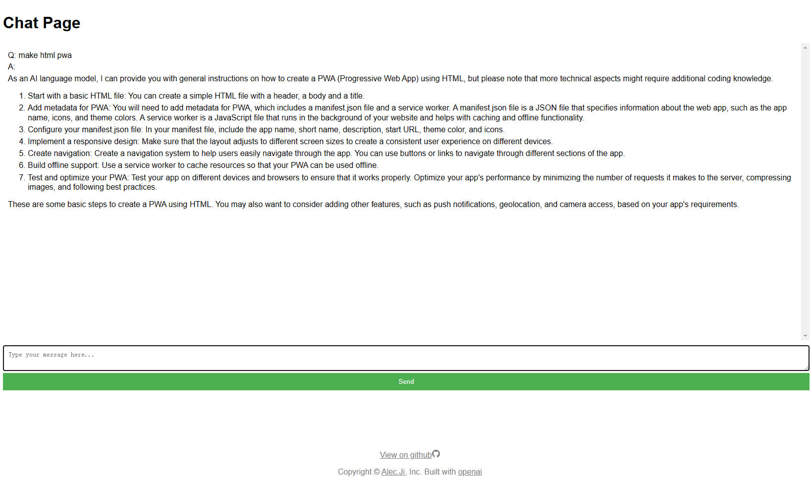
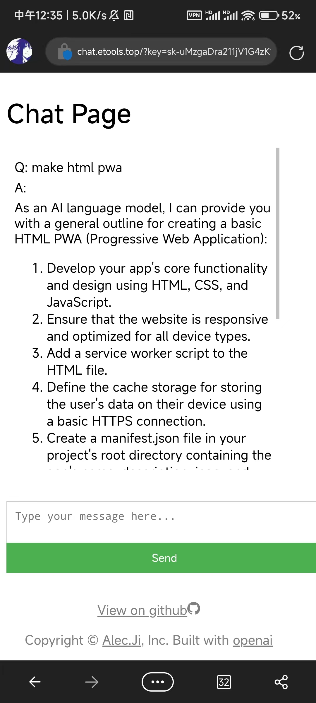

# GPT3.5-H5-lite-page

*code,readme by new bing,chatgpt*

a GPT3.5 web page, extremely lightweight and can be deployed statically, with no need for a server

**English Description**

This is a repository for a GPT3.5 web page, consisting of a single-page application called "GPT3.5-H5-lite-page". This page is extremely lightweight and can be deployed statically, with no need for a server. It is perfect for quickly showcasing your product or service in a simple and intuitive way. If you're looking for an efficient way to present your content or product, then this project is definitely worth checking out.

**中文说明**

这是一个 GPT3.5 的网页仓库，内含一个名为 "GPT3.5-H5-lite-page" 的单页面应用。该页面极为轻量级，可以直接进行静态部署，并且不需要服务端。它可以快速地展示您的产品或服务，并提供简单直观的用户体验。如果您正在寻找一种高效的方式来展示您的内容或产品，那么这个项目将是您的不二之选。

## Features

- Simple and lightweight code
- Single-page application
- Can be deployed statically, with no need for a server
- Provides a simple and intuitive user experience
- use github-page deploy

## How to Use

1. Clone the repository
2. Deploy `index.html` to your server or CDN
3. Run `index.html` to preview the page

🪧 you can start with `index.html?key=xx` auto completed api key , and auto hide

## REF

- [new bing](https://new.bing.com)
- [openai](https://openai.com/)
